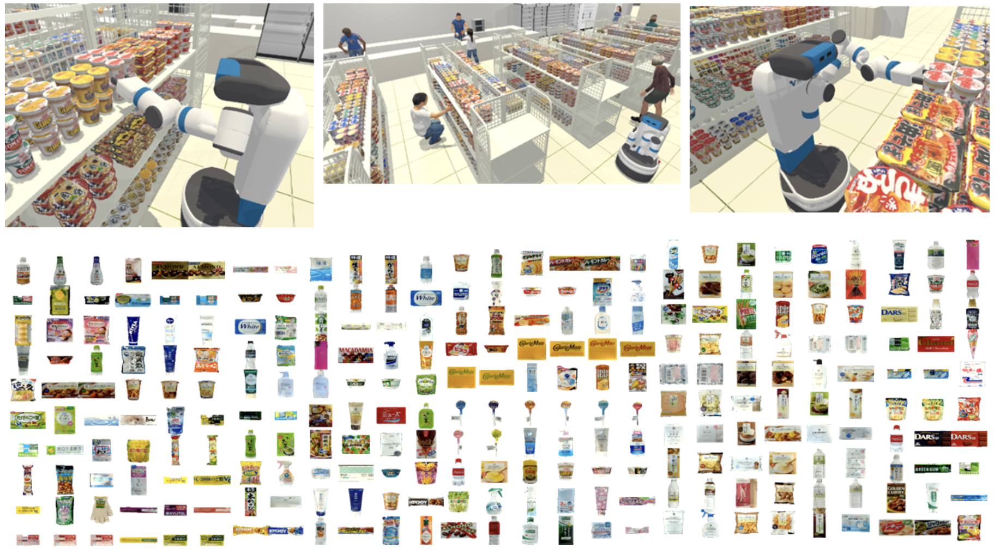
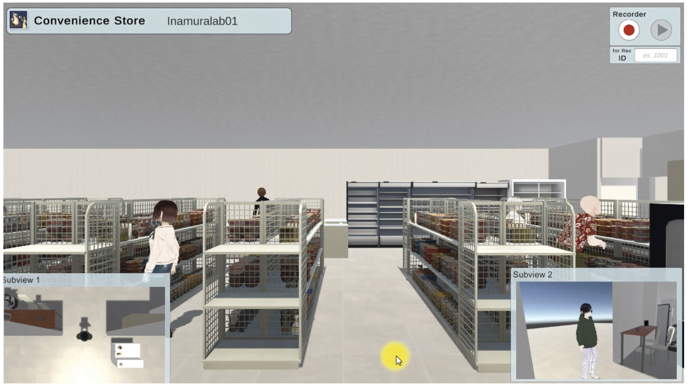

# WRS Future Convenience Store Challenge in Cyber Space
## Rulebook  (ver.0)
**The final Rulebook will be finalized around the end of March 2024.**

## Aim of the competition

We are currently planning to host an international competition that focuses on the advancement of AI and robotics technologies. The objective of this competition is to enhance the quality of customer service provided by intelligent robots in environments such as retail stores and shopping malls, and to realize new forms of services. Specifically, the competition will assess the ability of robots to engage in natural and friendly communication in the context of customer service, as well as their capability for cooperative work with human staff.
While previous competitions have primarily evaluated physical functionalities such as object recognition, human behavior recognition, navigation, and object manipulation using real robots, there have been limitations in smoothly conducting competitions when focusing on intellectual interactions, such as intention recognition, natural language understanding, conversation control, and resolving ambiguity. Therefore, this competition aims to improve the quality of dialogue systems for service robots collaborating with humans in retail stores and to achieve new interactive service systems by focusing on tasks that emphasize dialogue intelligence rather than physical functionality.
Furthermore, this competition features a unique structure where robots in virtual space engage in dialogue with humans in real-world environments. We invite proposals that contribute to the realization of new services through the integration of metaverses, digital twins, cyber-physical systems, and robotics. As such, the competition is designed based on the simulator "SIGVerse," which enables robots to engage in embodied and social interaction in virtual reality (VR) environments.
Participants will benefit from focusing solely on software development without the need to develop physical robots. Therefore, collaboration with various research communities such as computer vision (ICCV, CPVR), natural language processing (ACL, EMNLP), and machine learning (NeuRIPS, CoRL) is expected.


## Software system of the competition
The based software system used in the competition is an open system called SIGVerse, which is available to all users, including competitors, free of charge.

SIGVerse :https://github.com/SIGVerse/sigverse_unity_project/wiki

Download site : https://github.com/SIGVerse/sigverse_unity_project

Examples of a convenience store environment used in this competition is shown below


As shown above, more than 250 products and retail store environment have been implemented and are already ready for download on GitHub.

# Competition tasks and its rule
## Task 1：Interactive Customer Service

This competition focuses on realizing robots that provide customer service in a conversational format at convenience stores. The emphasis is on the interaction capabilities with customers.

In this task, functionalities such as image recognition, human state recognition, and location identification, which involve recognizing the customer's location in the store, their gestures, and the placement of items, are not evaluated. Instead, the focus is on engaging in accurate dialogue with customers in response to ambiguous requests and delivering the desired products to them. Customers convey their desired purchases to the service robot and request them to be placed in the shopping basket, using both natural language expressions and image presentation. Examples of specific requests are provided below:
```
Example 1: "Please bring me some tea." (Request made using natural language only)
Example 2: "I'd like some chocolate and potato chips." (Request made using natural language only)
Example 3: "I want something similar to this but with a different flavor." (Request made using both natural language and image presentation)
```
In response to these ambiguous requests, the service robot can ask questions to the customer. However, the questions should be limited to closed-ended questions that can be answered with a "Yes" or "No," rather than open-ended questions. The referee will respond to the robot's questions with a button press indicating "Yes" or "No."

The types and quantities of products the customer desires, as well as the ambiguous expressions they may use, are predetermined by the competition organizers. During the competition, text messages and image files will be sent from the competition system to the participants' software programs via network communication. The referee will use the competition system to send "Yes" or "No" responses to the participants' software.

Ideal dialogue examples for the scenarios mentioned above are provided below:

Ideal Response Example 1:
```
Customer: "Please bring me some tea."
Robot: "Do you mean Oolong tea?"
Customer: "No."
Robot: "Would you like green tea then?"
Customer: "Yes."
Robot: *Places green tea in the shopping basket* Task completed.
```

Ideal Response Example 2:
```
Customer: "I'd like some potato chips."
Robot: "For potato chips, we have salted, consomme, and BBQ flavors. Would you like consomme?"
Customer: "Yes."
Robot: "We have small and large sizes. Would you like the small size?"
Customer: "No."
Robot: "Understood. I will get you big size consomme-flavored potato chips." *Places the relevant items in the shopping basket* Task completed.
```

Ideal Response Example 3:
```
Customer: "I want something similar to this but with a different flavor."
(A text message and image file are sent from the system.)
Robot: "You're referring to black tea. The image shows milk tea, and other options include straight tea and lemon tea. Would you like lemon tea?"
Customer: "Yes."
Robot: "I will bring you lemon tea." *Places the relevant item in the shopping basket* Task completed.
```

Each correctly placed item in the shopping basket earns 10 points, while each incorrectly placed item deducts 10 points. Additionally, asking more than 5 questions for a single request results in a deduction of 1 point per question. Completing the task with fewer than 5 questions results in additional points based on the reduced number of questions asked. Thus, avoiding unnecessary questions is essential. The competition involves repeating various requests multiple times. Each repetition of a request is referred to as a session, with at least 10 sessions per competition. The exact number of sessions for the competition will be announced approximately two weeks before the event.

If the point of a certain session becomes negative value, let the point of the session zero. Points are accumulated for all sessions, and the highest total score among the participating teams is normalized to 100 points, representing each team's score for "Interactive Customer Service."

The table below lists specific values for points awarded or deducted:

| Evaluation target  |  Point   |
|----------------------------|-------------| 
| Scceeded to put suitable products into a cage  | +10 per product |
| Filed: put wrong products into a cage  | -10 per product | 
| Complete the task with no more than 5 times (n times) questions | +2 x (5-n) |
| Ask questions more than 5 times (n times) | subtract (n-5) |
| Give up                                   | The earned points up to the give up shall be the score for that session|
| Error of participant's software           | Let the score of the session 0 |

Note: The "Give Up" action can be taken at any time by the software developed by participants. In this case, the score for that session will be the earned points when "Give Up" was occurred, and the competition continues with the next session.

If the software system, developed by participants, encounters an error making it impossible to continue, the competition resumes from the next session. The point of that session will be zero, regardless of the points earned up to the error.

### List of APIs for Participants

Participants will control the robot's conversational function using the following APIs. The APIs will be provided in ROS, and detailed documentation is scheduled to be released around the end of February 2024.

(Communication commands between participants' software and the competition system)
- Receiving natural language requests from customers
- Receiving image data used for customer requests
- Sending questions to customers
- Receiving "Yes / No" responses from customers
- Executing actions to pick up the target product ID
  - There is no need to execute physical robot control actions such as navigation to the location of the target product or grasping the object. Simply specifying the product ID will automatically generate the action of picking up the target product and bringing it to the customer.
- Executing actions to place the currently held product into the shopping basket
  - The robot can only hold one product at a time. It is possible to engage in confirmation dialogue such as "Is this product okay?" before placing it in the shopping basket. However, it is not necessary to conduct such confirmation dialogue.

### Pre-provided Data for Participants
- 3D models of products
- Table data mapping product IDs to labels (product names)

### Additional tools / Internet connection
The participants will build a software to realize such an intelligent dialogue system for customer service robots. The participants can use OpenAI API or related LLM tools; however, we cannot guarantee the quality of the Internet connection at the competition site. If you use such an external cloud calculator, you must manage the risk yourself. Please note that installing your own wireless router will not be allowed.

## Competition Task 2: Future Convenience Store Visionary Design
In this competition, instead of completing tasks according to predefined rules, participants will propose possibilities for customer service and intelligent human-robot collaboration systems in future convenience stores in a presentation format based on their own creative ideas. The novelty, feasibility, and technical challenges of their ideas will be evaluated. The evaluation will focus on intelligent systems, service systems, and other systems mainly involving interaction with humans, which are expected to be useful in future convenience stores. Tasks that do not involve any interaction with humans, such as autonomously cleaning toilets, are not included. Teams are encouraged to demonstrate the latest research and development on new approaches and applications related to customer service and employee support systems in a cyber environment. Specific examples of systems/proposals subject to evaluation include but are not limited to:

- Planning systems that dynamically change and optimize the roles of service robots and employees.
- Interactive service robot systems that recognize customer intentions and provide accurate services.
- Training systems that determine appropriate training menus based on the skill levels of new employees.
- Algorithms that observe customer purchasing behavior/movement paths and determine the optimal display layout.
- Planning systems that dynamically change tasks to be executed based on the congestion status inside the store.

Participants can use various types of systems and devices, including actual robot systems, but the primary focus of the final demonstration is on utilizing virtual spaces or Cyber Physical Systems for the realization of intelligent service robots. Examples include digital twin systems supporting customer service action planning by intelligent robots and information presentation systems using wearable devices for efficient employee tasks. While the use of the competition system SIGVerse is not mandatory, the type of simulator/VR software used does not affect the evaluation results. Additionally, equipment used for demonstrations, such as VR headsets, can be provided by the competition organizers or brought by the participants themselves.

### Presentation Format
Each team has a total of 20 minutes, including time for presentation and Q&A. The presentation space will be shared among all teams, so all setup, equipment setup, PC connection, system startup, equipment removal, and restoration to the original state must be completed within the allotted time.
- 15 min 
  - Presentation and demonstration 
  - * Includes preparation time such as equipment setup and software startup
- 5 min 
  - Q&A from the judges
  - * Includes time to remove equipment and restore the original state

The language used for slides and oral explanations in the presentation must be English. While remote communication tools such as Zoom can be used, it is not recommended due to the potential instability of the venue's network communication environment. However, teams may use these tools at their own discretion. As the presentations will be live-streamed or broadcasted afterward on YouTube, the use of music that violates copyright during the presentation is not allowed.

Judges for evaluation will be appointed and determined by the competition organizers, with a minimum of four judges evaluating each presentation. Since some judges may not be native English speakers, the competition organizers will provide translation assistance during the Q&A session if necessary. Additionally, to ensure that non-experts in robotics and information technology can also participate as judges, presentations should be understandable to the general public without excessive use of technical terms.

The evaluation criteria are as follows:
- Academic novelty and originality of the underlying technology of the proposed system
- Utility and societal impact of the proposed system when implemented in real-world scenarios
- Strength of the relationship between humans and robots/systems in convenience stores
- Difficulty and technical challenges of tasks performed in the demonstration
If additional evaluation criteria are added, the participants will be notified of the changes at least one week in advance.

The scores will be totaled, and the highest-scoring team's score will be normalized to 100 points, representing each team's score for "Future Convenience Store Design."

The final winner will be determined by adding the scores from Competition 1 "Interactive Customer Service" and Competition 2 "Future Convenience Store Design."

### Competition Schedule & Timetable (Tentative)
- Setup (13th May) (Same day as the first-day workshop)
- Day1: (14th May) 12:30--15:00 Interactive Customer Service
- Day2: (15th May) 9:00--11:30 Future Convenience Store Design
- Award & Closing 12:30--13:00

### Prize Money
Based on the ranking, the top three teams will be awarded certificates and prize money as follows:
- 1st place: 100,000 JPY + certificate    
- 2nd place:  50,000 JPY + certificate
- 3rd place:  30,000 JPY + certificate
